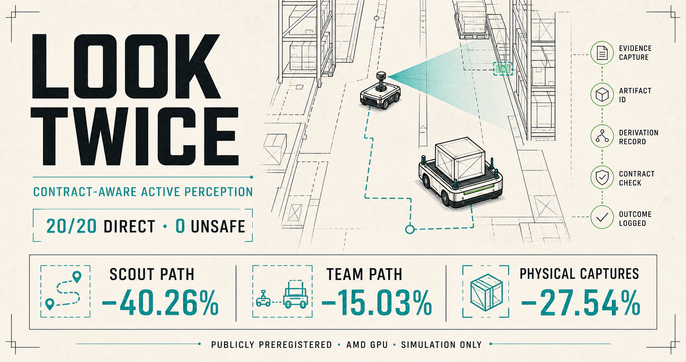
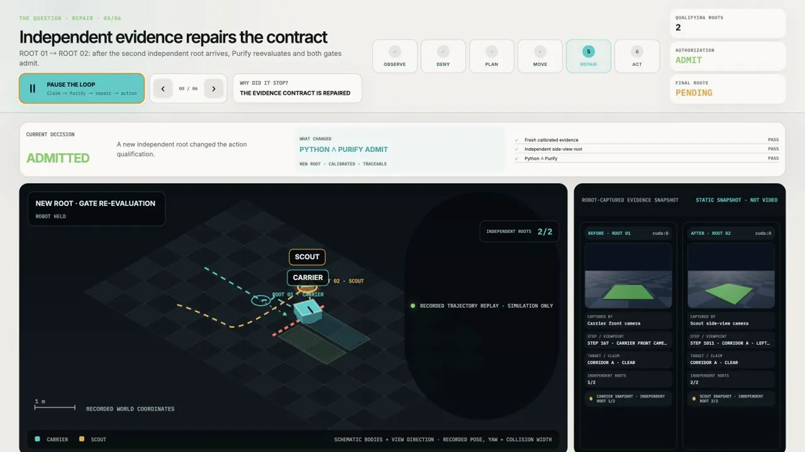

# Look Twice

### Action-ready evidence for warehouse robots

[](https://github.com/eason4kim-rocket/look-twice/actions/workflows/ci.yml?query=branch%3Av8-contract-progress-nbv)

**AMD Radeon Hackathon 2026 · Track 3: Physical AI Challenge · Liu Liang**

Warehouse AMR simulation on AMD Radeon and ROCm

[](https://eason4kim-rocket.github.io/#full-demo)

**[Watch the 3:59 demo without downloading](https://eason4kim-rocket.github.io/#full-demo)** ·
[Explore the live Evidence Console](https://eason4kim-rocket.github.io/console) ·
[Read the technical report](https://github.com/eason4kim-rocket/look-twice/releases/download/v8-competition-candidate/Look-Twice-V8-Technical-Report.pdf) ·
[Reproduce the evidence](docs/V8_REPRODUCTION.md)

The full video is also [stored in this repository](showcase/public/media/Look-Twice-V8-Demo.mp4),
with a [hash-verified Release mirror](https://github.com/eason4kim-rocket/look-twice/releases/download/v8-competition-candidate/Look-Twice-V8-Demo.mp4).
The player, results pages, data adapters, tests, and complete website source are
all in [`showcase/`](showcase/).

### Thirteen-second proof: repair → dual admit → direct move

<a href="https://eason4kim-rocket.github.io/#full-demo">
  
</a>

This is a silent excerpt of the recorded simulation replay—not a new
experiment or physical-robot footage. **Click the moving preview to jump to the
complete 3:59 demo on the project site**, or
[play the 13-second 1080p MP4 directly](https://eason4kim-rocket.github.io/media/look-twice-repair-to-action-proof.mp4).

## The warehouse problem

A loaded warehouse carrier is approaching a corridor. Its first RGB-D view is
ambiguous. Six software Claims may appear to support the route, but if they all
come from the same camera capture, they are still only one physical
observation.

Look Twice checks whether the evidence is good enough **for the next physical
action**. If it is not, the system explains what is missing, sends a low-risk
scout to collect a useful new view, and evaluates the same action again. The
carrier moves directly only after the evidence passes both authorization
paths; otherwise it detours or remains denied.

```text
AMD-accelerated Genesis RGB-D
        ↓
lineage-aware Claims + calibrated prediction set
        ↓
Action Contract for this robot, payload, corridor and time window
        ↓
Python policy ∧ Purify Go contract gate
        ↓
direct motion, targeted evidence repair, or safe detour
```

The main loop is simple: **deny → diagnose → acquire new evidence →
re-qualify**.

## What is different

### Physical evidence, not message count

RGB, depth, copied artifacts, and forwarded Claims from one capture cannot
vote as independent observations. Look Twice traces them back to physical
capture roots before counting support.

### An Action Contract, not a confidence threshold

A model score is not permission to move. Evidence must be fresh, calibrated,
in scope, and sufficiently independent for a named robot, payload, corridor,
action, and validity window.

### BeliefGap-driven active repair

A denial includes a machine-readable reason: missing viewpoint, weak
independence, stale evidence, unresolved prediction set, or another bounded
gap. The scout uses that gap to choose the next observation instead of blindly
waiting or collecting more of the same view.

### Calibrated ambiguity stays ambiguous

Split-conformal prediction sets carry uncertainty into the gate. An ambiguous
set or an out-of-scope calibration cannot silently become a clear corridor.

### Python and Purify Go must agree

Purify is the standalone Go reference contract core in
[`purify_robotics/`](purify_robotics/), not another perception model. Direct
motion requires agreement between the Python policy and this separately
compiled gate. A missing service, failed clause, or disagreement keeps the
action closed.

### Every decision leaves a receipt

Each `GateReceipt` records the Claims used and discounted, physical roots,
clause results, BeliefGaps, validity window, and content hash. Later evidence
can invalidate an earlier plan without erasing its history.

## Demonstrated result

The headline comparison uses paired simulated warehouse worlds with the same
initial condition for active and passive policies.

| Evidence tier | Result |
| --- | --- |
| Permanent locked V8 test | Active direct route **11/12**; passive **0/12**. Both completed 12/12 missions. |
| Publicly preregistered 30-world challenge | Active full-chain direct **29/30**; passive **0/30**. **60/60** missions completed with 0 recorded unsafe episodes and 0 fallbacks. The one dual-blocked world took the safe detour. |
| Active-view efficiency supplement | Both selectors preserved **20/20** direct outcomes. The candidate reduced mean scout path **40.3%**, mean team path **15.0%**, and physical captures **27.5%** relative to the baseline selector. |
| Wheel-dynamics replay | **30/30** archived decisions passed across 30 serial three-robot scenes: 30 scouts, 30 active carriers, and 30 passive carriers reached their goals using wheel-speed control after build. |
| Solver-scale complement | The same 30 fixed decisions passed as **20/20** in one 60-body scene and **10/10** in one 30-body scene: 90 cumulative distinct robots, with at most 60 co-resident. |

The preregistered challenge is the primary public supplement. The efficiency,
dynamics, and scale rows are separate same-generator simulation studies; they
do not replace the locked result or claim physical-robot validation.

Evidence:

- [Compact challenge evidence card](docs/V8_FROZEN_CHALLENGE_JUDGE_CARD.md)
- [30-world challenge report](release/v8-frozen/results/challenge_102500_102529/CHALLENGE_REPORT.json)
- [Active-view efficiency result](docs/V8_CONTRACT_PROGRESS_CHALLENGE_RESULT.md)
- [30-seed decision-bound dynamics result](docs/V8_ADDITIVE_DECISION_DYNAMICS_RECOVERY_V2_RESULT.md)
- [60-body prefix report](release/v8-derived/decision_dynamics_single_scene_60_102500_102519/REPORT.json)
- [30-body suffix report](release/v8-derived/decision_dynamics_single_scene_30_suffix_102520_102529/REPORT.json)
- [Raw challenge archive](https://github.com/eason4kim-rocket/look-twice/releases/download/v8-competition-candidate/v8-frozen-challenge-102500-102529.raw.tar.gz)

## AMD Radeon and ROCm

| Layer | Role in Look Twice |
| --- | --- |
| AMD Radeon `gfx1100`, 48 GiB | Competition GPU environment |
| Genesis 1.1.2 with `gs.amdgpu` | Warehouse simulation and RGB-D rendering |
| PyTorch 2.9.1 ROCm / HIP 7.2 | Spatial RGB-D inference and tensor processing |
| `rocm-smi` telemetry | Full-run utilization, memory, power, and temperature record |
| Purify Go core on CPU | Deterministic contract evaluation and receipt generation |

All 60 preregistered challenge episodes loaded the frozen checkpoint, rendered
live Genesis RGB-D, ran spatial inference through the ROCm stack, and emitted
Go receipts. The complete 1,685.5-second wall is covered by 844 retained
telemetry samples, including idle time. See the
[AMD environment](docs/V8_AMD_ENVIRONMENT.md),
[telemetry](release/v8-frozen/results/V8_FROZEN_ROCM_TELEMETRY.json), and
[technical report](docs/V8_TECHNICAL_REPORT.md) for the exact configuration
and measurement boundaries.

## Try it

The public site is a browser-native replay of recorded evidence. It does not
need a GPU or a private service:

```bash
cd showcase
npm ci
npm test
npm run dev
# open http://localhost:3000
```

Run the core evidence checks on CPU:

```bash
python3 scripts/build_competition_replays.py
python3 scripts/build_competition_hook.py
python3 -m unittest tests.test_competition_replay -v

cd purify_robotics
go test ./...
```

The original source-SHA guard is tied to the immutable frozen-foundation tag,
not to this later additive branch:

```bash
git clone --branch v8-competition-final-2026-08-05 --single-branch \
  https://github.com/eason4kim-rocket/look-twice.git look-twice-frozen
cd look-twice-frozen
python3 scripts/verify_frozen_foundation.py
```

Or launch the packaged console from the repository root:

```bash
docker compose up --build
# open http://localhost:3000
```

The [full reproduction guide](docs/V8_REPRODUCTION.md) covers the challenge
archive, locked-input verifier, dynamics reports, scale reports, AMD runtime,
and frozen checkpoint identity.

## Open source contribution

The repository includes the public schemas, Go contract core, Python policy
and repair planner, validators, deterministic replay builder, evidence data,
and the full website.

During this work, a Genesis URDF inertial-origin issue was isolated and
reported upstream as [issue #3183](https://github.com/Genesis-Embodied-AI/genesis-world/issues/3183).
The focused fix is open as [PR #3184](https://github.com/Genesis-Embodied-AI/genesis-world/pull/3184),
with its [bounded validation record](docs/V8_GENESIS_PR_3184_VALIDATION.md).
The PR is open and unmerged; no upstream acceptance is claimed.

## Repository guide

| Path | Contents |
| --- | --- |
| [`showcase/`](showcase/) | Complete bilingual evidence website, native video player, data, and tests |
| [`src/`](src/) | Robot loop, RGB-D model, Claims, conformal qualification, and repair planning |
| [`purify_robotics/`](purify_robotics/) | Standalone Go Action Contract reference core |
| [`schemas/`](schemas/) | Public Claim, Action Contract, receipt, and BeliefGap schemas |
| [`release/v8-frozen/`](release/v8-frozen/) | Frozen V8 manifests, reports, and guarded evidence import |
| [`release/v8-derived/`](release/v8-derived/) | Clearly separated additive simulation evidence |
| [`scripts/`](scripts/) | Reproduction, verification, replay, benchmark, and packaging tools |
| [`docs/`](docs/) | Technical report, architecture, evidence boundaries, and validation notes |
| [`submission/official-repo/`](submission/official-repo/) | Self-contained Track 3 submission package prepared for review |

## Scope

Look Twice V8 is a simulation research prototype for warehouse AMRs. Its
formal result is the frozen candidate; later supplements are labeled
separately. In the primary kinematic runs, carrier and scout are logical poses,
viewpoints, and capture roots on one shared Genesis chassis—not two robots
moving simultaneously. The separately labeled wheel-dynamics studies
instantiate non-fixed bodies. The project does not claim real-robot
deployment, sim-to-real or OOD performance, simultaneous 90-robot fleet
control, formal safety proof, or certification. Content hashes detect changes
but do not prove that a sensor's original observation was truthful. Full boundaries are documented in
[`docs/V8_EVIDENCE_BOUNDARY.md`](docs/V8_EVIDENCE_BOUNDARY.md).

Built by **Liu Liang** for Track 3 of the AMD Radeon Hackathon 2026.

Apache-2.0. [`NOTICE`](NOTICE) defines the public Purify reference-core boundary.
