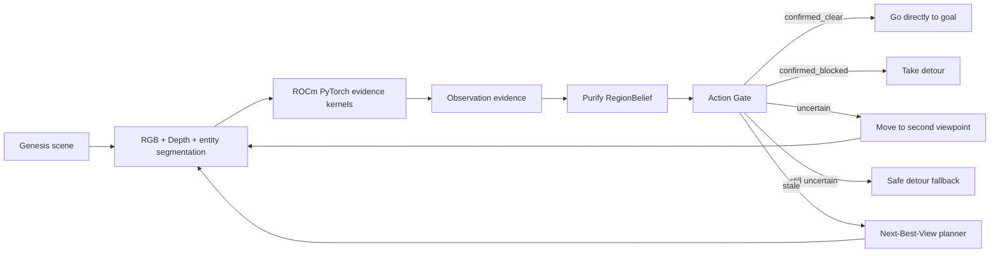
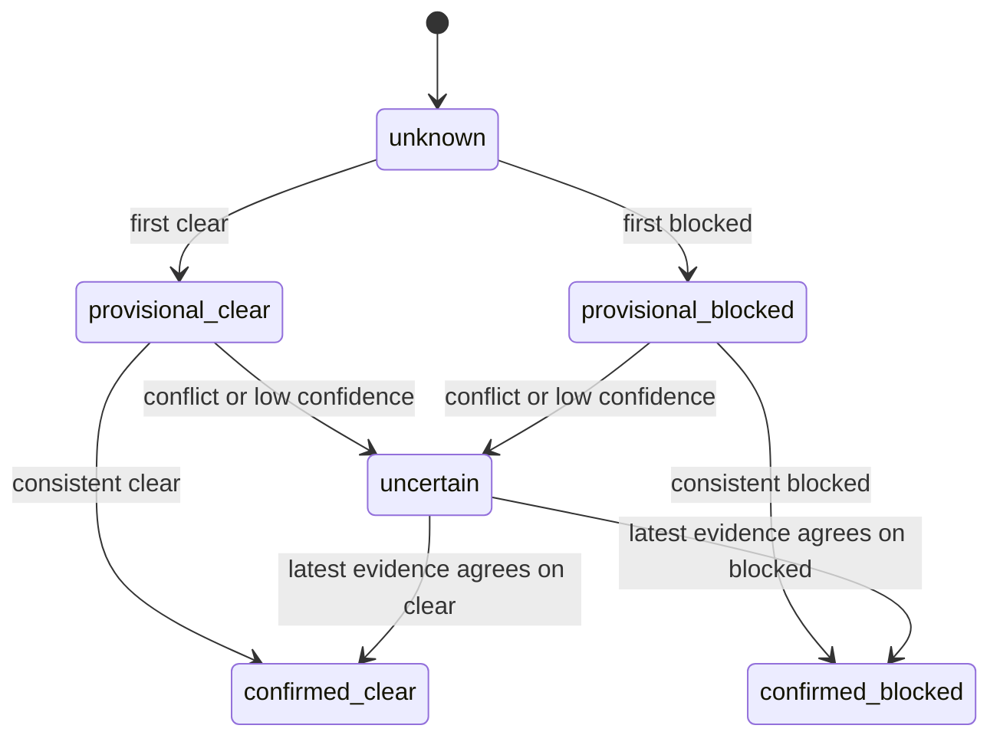
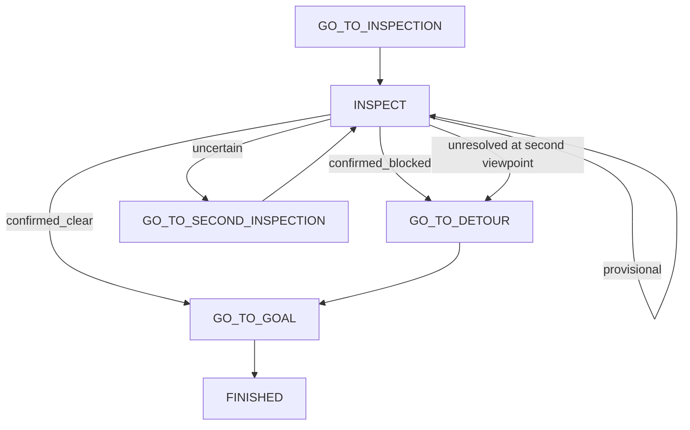

# Look Twice architecture

## Data flow



The implementation deliberately separates:

- **scenario** — what is actually present in the world;
- **observation** — what one noisy sensing event reports;
- **belief** — what can be concluded from recent evidence;
- **action** — what the reliability gate permits the robot to do.

V2 adds two more boundaries:

- **viewpoint planning** uses only known target/occluder geometry and travel
  cost; it never reads the unknown blocking obstacle state;
- **temporal validity** expires confirmed evidence after a configurable TTL,
  starting a new evidence epoch before the robot can enter the passage.

In `--sensor-mode camera`, the observation comes from a 320×240 Genesis RGB
camera placed at the robot's current inspection viewpoint. A small,
deterministic red-pixel detector produces `clear` or `blocked`; visible pixel
support determines confidence, and the raw frame can be saved as an evidence
artifact. The controller never reads the obstacle entity position in this
mode.

## Belief lifecycle



Only `confirmed_clear` grants direct-passage permission. Confirmed blockage
selects the planned detour. Unresolved uncertainty never becomes a fabricated
blocked belief; the belief remains `uncertain` while the controller selects a
conservative detour.

## Mission state flow



V2 inserts `VERIFY_BEFORE_CROSSING` before the inspected passage. A stale
belief transitions to `GO_TO_REINSPECTION`, while a current confirmed-clear
belief grants passage entry. Dynamic obstacle events therefore revise actions,
not just logs.

## Next-Best-View score

Four candidate viewpoints are ranked deterministically:

```text
score = expected_visibility
      - 0.25 * normalized_travel_cost
      - 0.40 * revisit_penalty
```

Expected visibility is estimated by two-dimensional ray sampling against the
known occluder rectangle. JSON results retain the full ranking for every
selection.

## Policy comparison

All three policies receive observations from the same scene and noise model:

| Policy | Rule | Expected trade-off |
| --- | --- | --- |
| Single Shot | Act on the first observation | Lowest cost, highest error risk |
| Majority Vote | Always take three observations | Robust but fixed observation cost |
| Purify | Confirm consistent evidence; reinspect conflicts | Adaptive safety/cost balance |

The batch experiment varies scenario, observation noise, policy, and seed while
recording raw evidence and decisions for every episode.
