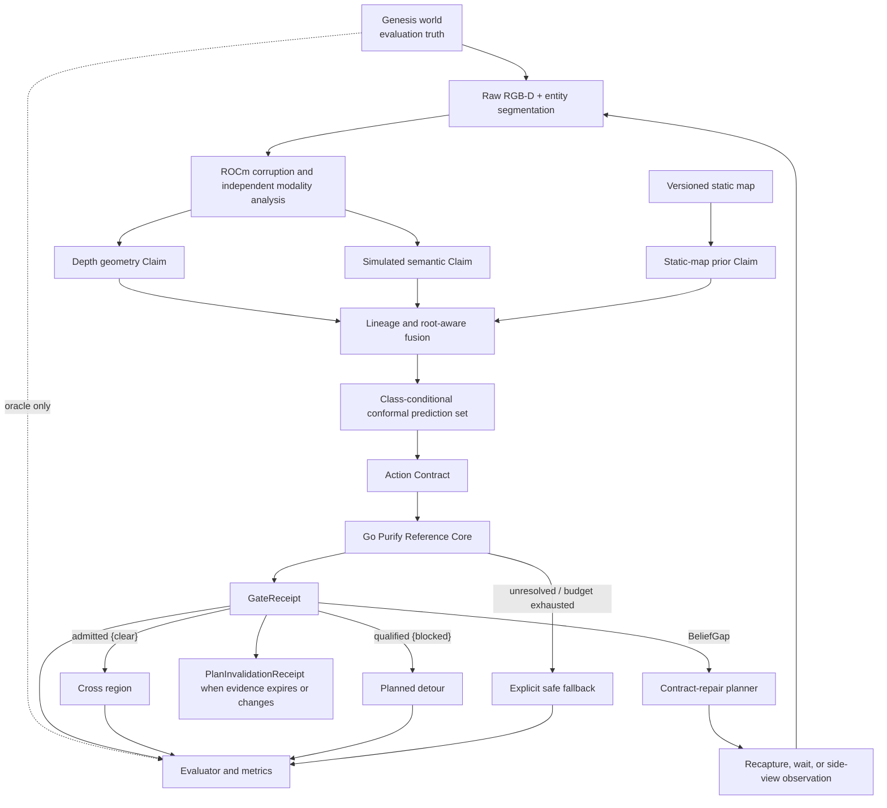

# Look Twice v4 architecture

## Purpose

Look Twice v4 is an evidence-assurance layer around a simulated navigation
task. It does not claim to replace a navigation stack. It qualifies whether a
world fact is strong enough for a scoped physical action, explains why it is
not, and selects an observation intended to repair that evidence gap.

中文理解：导航器负责“怎么走”，v4 负责“现有证据是否足以允许这次动作”；如果
不足，它还会指出缺什么证据，并驱动机器人去获取。

## End-to-end data flow



The dotted oracle path is physically and structurally separate from the online
planner. `ScenarioSample.public_context` contains known geometry and candidate
view information; `oracle_context` contains truth and realised faults and is
available only to the simulator/evaluator.

## Evidence contracts

### Robot Claim v1

Each immutable Claim records:

```text
claim/fact/predicate/value/confidence
observed_step/valid_until_step
modality/device_root_id/capture_root_id
calibration_id/pose_version/model_id
artifact_sha256/parent_claim_ids
quality/visibility/temporal_skew
robot/payload/region scope
```

Clean simulator truth is not a valid Claim field. The Python constructor rejects
unknown wire fields, including an attempted `oracle` field.

The three online sources are deliberately separate:

- `depth_geometry` analyses only depth within a projected risk-region ROI;
- `simulated_semantic_sensor` analyses only corrupted entity segmentation;
- `static_map` supplies a versioned prior and never counts as a physical root.

### Conservative lineage

Evidence is not counted by row count. Claims are conservatively joined when
they share a capture, artifact, or declared parent lineage.

```text
one RGB-D capture
├── Depth Claim
├── Semantic Claim
└── forwarded/derived Claims
        = one physical measurement root
```

An identical artifact is discounted. An empty/unknown root is never assumed to
be independent. Multiple capture roots may share one device root; the receipt
reports both quantities.

### Calibration Artifact

Class-conditional split conformal uses nonconformity score `1 - p_true_class`
and the finite-sample rank `ceil((n + 1) × (1 - alpha))`. The versioned artifact
contains:

- `alpha` and clear/blocked class quantiles;
- applicable profiles and noise-intensity interval;
- accepted sensor versions;
- Git commit, dataset SHA256, and inclusive seed ranges.

The output is `{clear}`, `{blocked}`, or unresolved `{clear, blocked}`. An empty
mathematical set is normalised to unresolved. Profile, intensity, or sensor
version mismatch makes calibration inapplicable and fails closed.

The coverage statement applies only to the declared simulated ID population.
It is not a universal or real-world safety guarantee.

## Action qualification

The default `cross_region` contract requires:

```text
prediction_set == {clear}
evidence_age <= 60 simulation steps
distinct_measurement_roots >= 2
modality_skew <= 2 simulation steps
unresolved_conflicts == 0
calibration_applicable == true
exact robot/payload/region scope match
```

The Go core emits a deterministic `GateReceipt` containing every clause,
accepted and discounted Claims, roots, prediction set, BeliefGaps, validity,
assumptions, and a canonical SHA256. It emits a
`PlanInvalidationReceipt` when a previously qualified plan expires or a new
contradictory Claim arrives.

Neither receipt is a cryptographic signature or a safety certification; the
hash detects content changes and enables audit/reproduction.

## Python ↔ Go protocol

The Go 1.23 reference core is a persistent, stateless NDJSON subprocess:

```json
{"schema_version":"purify.robotics.command.v1","request_id":"py-00000001","op":"evaluate_action","payload":{}}
{"schema_version":"purify.robotics.response.v1","request_id":"py-00000001","ok":true,"result":{},"error":null}
```

Operations:

- `evaluate_action`: Claims + Action Contract + Calibration Artifact + current
  public evaluation context → GateReceipt;
- `invalidate_plan`: previous GateReceipt + current step + triggering Claims →
  PlanInvalidationReceipt.

The bridge permits one in-flight command, checks schema and request IDs, uses a
deterministic timeout, and terminates the process on timeout/protocol failure.
It does not silently reopen the gate after a service error.

## Active evidence repair

BeliefGap reasons are finite and machine-readable:

```text
stale                       shared_root
insufficient_roots          modality_conflict
time_skew                   low_coverage
calibration_not_applicable
```

Candidate actions are same-view synchronous recapture, wait-and-recapture, and
four side viewpoints. The frozen utility is:

```text
0.45 × expected_contract_repair
+ 0.25 × new_measurement_root_gain
+ 0.20 × conflict_discrimination
+ 0.10 × predicted_coverage
- 0.25 × normalized_travel_cost
- 0.20 × revisit_penalty
- 0.30 × predicted_degradation
- 0.50 × physical_risk
```

Planner inputs exclude seed, profile, truth, future events, realised faults,
and realised noise. At most four observations and two replans are allowed. No
positive-utility candidate or exhausted budgets produce an explicit safe
fallback, never a fabricated `confirmed_blocked` fact.

## Motion boundary

Both backends implement the same `MotionController.move_to()` result contract:

```text
reached, final pose, trajectory, controls, path length,
collision count, elapsed steps, and completion reason
```

- `skid-steer`: four continuous wheel joints driven by left/right velocity
  targets in Genesis; intended for the physical-behaviour demo.
- `kinematic`: bounded differential-drive control integrated as a unicycle;
  Genesis applies the integrated pose with `set_pos()` for fast batch runs.

The deterministic synthetic CI runtime also uses kinematic integration but has
no Genesis, physics, GPU, or formal-result eligibility. The skid-steer backend
is implemented and unit-tested; its required W7900D seed acceptance is pending.

## Frozen comparison design

Policies:

| Policy | Lineage | Conformal | Active repair |
| --- | :---: | :---: | :---: |
| Naive Majority | No | No | No |
| V3 Log-Odds | No | No | No |
| Conformal Only | No | Yes | No |
| Lineage Only | Yes | No | No |
| Purify Passive | Yes | Yes | No |
| Purify Active | Yes | Yes | Yes |

Stress profiles:

| Profile | Primary stress |
| --- | --- |
| `independent-noise` | ordinary independent sensor degradation |
| `shared-occlusion` | correlated view-dependent evidence loss |
| `evidence-echo` | many Claims derived from one measurement root |
| `time-skew` | non-synchronous modality evidence |
| `pose-calibration-drift` | shared pose/calibration error |
| `structured-depth-dropout` | missing depth in the risk ROI |
| `dynamic-change` | absolute-time world-state change |
| `ood-severity` | outside the calibration domain |

The absolute event clock and paired profile/seed world prevent policies from
receiving easier scenes because they observe at different times.

## Current verification boundary

Implemented and locally verified: schemas, Go core, NDJSON protocol, Claim
lineage, conformal logic, policies, repair planner, metrics, motion control law,
and synthetic orchestration.

Pending on W7900D: v4 Genesis RGB-D integration acceptance, skid-steer seed
tests, fitted formal calibration artifact, 96/960/60 experiment matrices,
multi-environment feasibility, v4 GPU benchmark, formal video, and any upstream
PR. Synthetic output must never be substituted for these artifacts.

V3 architecture and published results remain frozen and are not reinterpreted
as v4 evidence.
